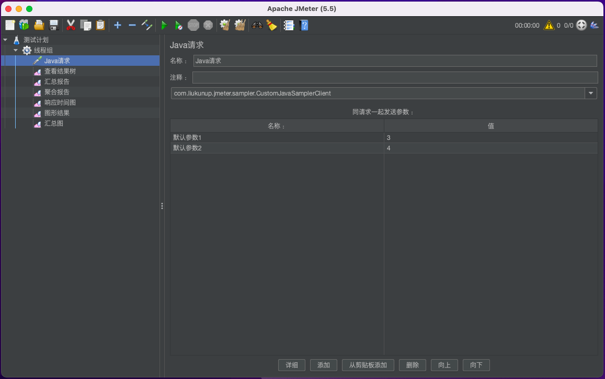

# Custom JMeter Extension

自定义`JMeter`扩展能力

## Sampler 取样器

### Java Request / Java 请求 

---

继承自`AbstractJavaSamplerClient`类以实现简易扩展（适用于熟悉Java编程语言的同学）

1. 创建一个自定义的`JavaSamplerClient`类，例如取名字叫`CustomJavaSamplerClient`； 代码参考 [CustomJavaSamplerClient.java](custom-java-sampler-client/src/main/java/com/liukunup/jmeter/sampler/CustomJavaSamplerClient.java)

2. 重写以下类方法

```java
@Override
public void setupTest(JavaSamplerContext context) {}

@Override
public void teardownTest(JavaSamplerContext context) {}

// 核心测试代码在这里执行
@Override
public SampleResult runTest(JavaSamplerContext javaSamplerContext) {}

@Override
public Arguments getDefaultParameters() {}
```

3. 打包部署

    3.1 使用右侧边栏子模块(custom-java-sampler-client) `Maven` -> `Lifecycle` -> `package` 进行打包；

    3.2 将 `target/custom-java-sampler-client-0.0.1-SNAPSHOT.jar` 拷贝到 `apache-jmeter-5.5/lib/ext` 目录下；

    3.3 新建测试计划，使用Java Request / Java 请求验证编写的代码。

    Tips: 对于代码较为复杂的情况，建议先在Idea中完成调试。

4. 验证效果

新建测试计划，进行如下图配置


使用Java Request / Java 请求，注意使用自己实现的类。



通过日志验证加法代码逻辑


通过时延/QPS验证代码耗时逻辑


## 下载最新JMeter版本

---

```shell script
export version=5.5
url=https://dlcdn.apache.org/jmeter/binaries/apache-jmeter-${version}.zip
wget ${url}
```
